---
## Front matter
title: "Лабораторная работа №6"
subtitle: "Поиск файлов. Перенаправление ввода-вывода. Просмотр запущенных процессов"
author: "Ежова Алиса Михайловна"

## Generic otions
lang: ru-RU
toc-title: "Содержание"

## Bibliography
bibliography: bib/cite.bib
csl: pandoc/csl/gost-r-7-0-5-2008-numeric.csl

## Pdf output format
toc: true # Table of contents
toc-depth: 2
lof: true # List of figures
fontsize: 12pt
linestretch: 1.5
papersize: a4
documentclass: scrreprt
## I18n polyglossia
polyglossia-lang:
  name: russian
  options:
	- spelling=modern
	- babelshorthands=true
polyglossia-otherlangs:
  name: english
## I18n babel
babel-lang: russian
babel-otherlangs: english
## Fonts
mainfont: PT Serif
romanfont: PT Serif
sansfont: PT Sans
monofont: PT Mono
mainfontoptions: Ligatures=TeX
romanfontoptions: Ligatures=TeX
sansfontoptions: Ligatures=TeX,Scale=MatchLowercase
monofontoptions: Scale=MatchLowercase,Scale=0.9
## Biblatex
biblatex: true
biblio-style: "gost-numeric"
biblatexoptions:
  - parentracker=true
  - backend=biber
  - hyperref=auto
  - language=auto
  - autolang=other*
  - citestyle=gost-numeric
## Pandoc-crossref LaTeX customization
figureTitle: "Рис."
tableTitle: "Таблица"
listingTitle: "Листинг"
lofTitle: "Список иллюстраций"
lotTitle: "Список таблиц"
lolTitle: "Листинги"
## Misc options
indent: true
header-includes:
  - \usepackage{indentfirst}
  - \usepackage{float} # keep figures where there are in the text
  - \floatplacement{figure}{H} # keep figures where there are in the text
---

# Цель работы

Ознакомление с инструментами поиска файлов и фильтрации текстовых данных.
Приобретение практических навыков: по управлению процессами (и заданиями), по
проверке использования диска и обслуживанию файловых систем.

# Задание

1. Осуществите вход в систему, используя соответствующее имя пользователя.
2. Запишите в файл file.txt названия файлов, содержащихся в каталоге /etc. Допи-
шите в этот же файл названия файлов, содержащихся в вашем домашнем каталоге.
3. Выведите имена всех файлов из file.txt, имеющих расширение .conf, после чего
запишите их в новый текстовой файл conf.txt.
4. Определите, какие файлы в вашем домашнем каталоге имеют имена, начинавшиеся
с символа c? Предложите несколько вариантов, как это сделать.
5. Выведите на экран (по странично) имена файлов из каталога /etc, начинающиеся
с символа h.
6. Запустите в фоновом режиме процесс, который будет записывать в файл ~/logfile
файлы, имена которых начинаются с log.
7. Удалите файл ~/logfile.
8. Запустите из консоли в фоновом режиме редактор gedit.
9. Определите идентификатор процесса gedit, используя команду ps, конвейер и фильтр
grep. Как ещё можно определить идентификатор процесса?
10. Прочтите справку (man) команды kill, после чего используйте её для завершения
процесса gedit.
11. Выполните команды df и du, предварительно получив более подробную информацию
об этих командах, с помощью команды man.
12. Воспользовавшись справкой команды find, выведите имена всех директорий, имею-
щихся в вашем домашнем каталоге.

# Выполнение лабораторной работы

1) Осуществила вход в систему, используя соответсвующее имя пользователя.

2) Записала в файл file.txt названия файлов, содержащихся в каталоге /etc. Дописала в этот же файл названия файлов, содержащихся в вашем домашнем каталоге:

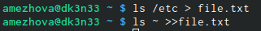{#fig:001 width=90%}

3) Вывела имна всех файлов из file.txt, имеющих расширение .conf, после чего записала их в новый текстовой файл conf.txt:

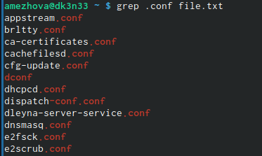{#fig:002 width=90%}

{#fig:003 width=90%}

4) Определила, какие файлы в вашем домашнем каталоге имеют имена, начинавшиеся с символа c? Предложила несколько вариантов, как это сделать:

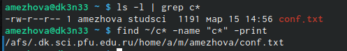{#fig:004 width=90%}

5) Вывела на экран (по странично) имена файлов из каталога /etc, начинающиеся с символа h:

{#fig:005 width=90%}

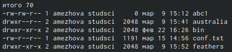{#fig:006 width=90%}

6) Запустила в фоновом режиме процесс, который будет записывать в файл ~/logfile файлы, имена которых начинаются с log:

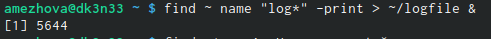{#fig:007 width=90%}

7) Удалила файл ~/logfile:

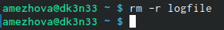{#fig:008 width=90%}

8) Запустила из консоли в фоновом режиме редактор gedit:

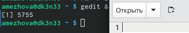{#fig:009 width=90%}

9) Определила идентификатор процесса gedit, используя команду ps, конвейер и фильтр grep:

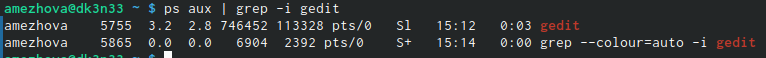{#fig:010 width=90%}

10) Прочитала справку (man) команды kill, после чего использовала её для завершения процесса gedit:

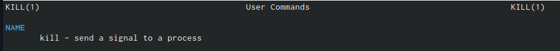{#fig:011 width=90%}

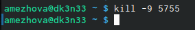{#fig:012 width=90%}

11) Выполнила команды df и du, предварительно получив более подробную информацию об этих командах, с помощью команды man:

Подробная информация:

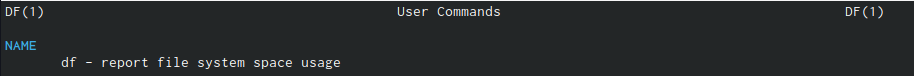{#fig:013 width=90%}

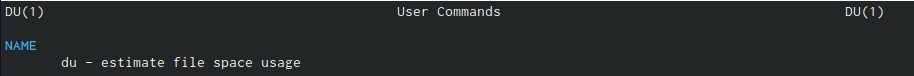{#fig:014 width=90%}

Выполнение команд:

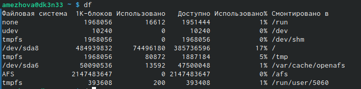{#fig:015 width=90%}

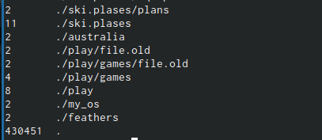{#fig:016 width=90%}

12) Воспользовавшись справкой команды find, вывела имена всех директорий, имеющихся в моем домашнем каталоге:

Справка:

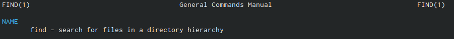{#fig:017 width=90%}

Имена всех директорий:

{#fig:018 width=90%}

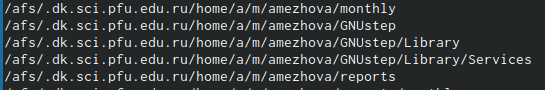{#fig:019 width=90%}

# Выводы

В ходе выполнения лабораторной работы №6, я ознакомилась с инструментами поиска файлов и фильтрации текстовых данных. Приобрела практические навыки: по управлению процессами (и заданиями), по проверке использования диска и обслуживанию файловых систем.
