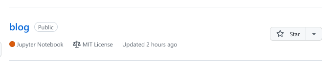

---
## Front matter
lang: ru-RU
title: Индивидуальный проект
subtitle: Этап 1
author:
  - Ежова А. М,
institute:
  - Российский университет дружбы народов, Москва, Россия
  - Факультет физико-математических и естественных наук
date: 22 февраля 2022

## i18n babel
babel-lang: russian
babel-otherlangs: english

## Formatting pdf
toc: false
toc-title: Содержание
slide_level: 2
aspectratio: 169
section-titles: true
theme: metropolis
header-includes:
 - \metroset{progressbar=frametitle,sectionpage=progressbar,numbering=fraction}
 - '\makeatletter'
 - '\beamer@ignorenonframefalse'
 - '\makeatother'
---

# Информация

## Докладчик

:::::::::::::: {.columns align=center}
::: {.column width="70%"}

  * Ежова Алиса Михайловна
  * студентка НБИбд-01-22
  * Российский университет дружбы народов
  * <https://github.com/AlisaEzhova>

:::
::: {.column width="30%"}


:::
::::::::::::::

# Вводная часть

## Актуальность

- Этот проект актуален для студенов, кто хочет создавать сайты и загружать на Github pages.

## Цели и задачи

- Установить необходимое программное обеспечение.
- Скачать шаблон темы сайта.
- Разместить его на хостинге git.
- Установить параметр для URLs сайта.
- Разместить заготовку сайта на Github pages.

## Материалы и методы

- Процессор `pandoc` для входного формата Markdown
- Результирующие форматы
	- `pdf`
	- `html`
- Автоматизация процесса создания: `Makefile`

# Создание презентации

## Процессор `pandoc`

- Pandoc: преобразователь текстовых файлов
- Сайт: <https://pandoc.org/>
- Репозиторий: <https://github.com/jgm/pandoc>

## Формат `pdf`

- Использование LaTeX
- Пакет для презентации: [beamer](https://ctan.org/pkg/beamer)
- Тема оформления: `metropolis`

## Код для формата `pdf`

```yaml
slide_level: 2
aspectratio: 169
section-titles: true
theme: metropolis
```

## Формат `html`

- Используется фреймворк [reveal.js](https://revealjs.com/)
- Используется [тема](https://revealjs.com/themes/) `beige`

## Код для формата `html`

- Тема задаётся в файле `Makefile`

```make
REVEALJS_THEME = beige 
```

## Получающиеся форматы

- Полученный `pdf`-файл можно демонстрировать в любой программе просмотра `pdf`
- Полученный `html`-файл содержит в себе все ресурсы: изображения, css, скрипты

## Содержание исследования

1) Скачиваем сайт hugo для генерирования страниц сайта. Скачиваем последнюю версию:

{#fig:001 width=90%}

##

2) Разархивируем данный файл и извлечем hugo файл:

{#fig:002 width=90%}

##

3) Копируем извлеченный файл hugo и создаем в домашней папке отдельную папку bin для hugo:

{#fig:003 width=90%}

##

{#fig:004 width=90%}

##

4) Создаем новый репозиторий и называем его blog:

{#fig:005 width=90%}

##

Клонируем созданный репозитоорий через терминал:

{#fig:006 width=90%}

##

5) Переходим в созданный репозиторий через терминал и проверим текущие файлы:

{#fig:007 width=90%}

##

6) Выполним команду ~/bin/hugo server:

{#fig:008 width=90%}

##

7) Открываем сайт через ссылку:

{#fig:009 width=90%}

##

Сайт:

{#fig:010 width=90%}

##

8) Чтобы избавиться от синей вывески нужно зайти в папку content и в файле _index.md удалить строчки с 8 по 38 включительно. После этого сайт обновится и будет нужного вида:

{#fig:011 width=90%}

##

Обновленный сайт:

{#fig:012 width=90%}

##

9) Создаем еще один репозиторий и клонируем его:

{#fig:013 width=90%}

##

{#fig:014 width=90%}

##

10) Переходим в новый репозиторий и создаем там новую ветку main:

{#fig:015 width=90%}

##

11) Создадим новый пустой файл и добавим его в репозиторий:

{#fig:016 width=90%}

##

{#fig:017 width=90%}

##

12) Подключим новый созданный репозиторий к папке public внутри нашего блока:

{#fig:018 width=90%}

##

13) Нам вывели, что .gitignore игнорирует каталог с названием pubic, исправим это, добавив # перед:

{#fig:019 width=90%}

##

{#fig:020 width=90%}

##

14) Далее заново выполняем команду bin/hugo:

{#fig:021 width=90%}

##

15) Переходим в папку public и проверяем, что она подключена к репозиторию:

{#fig:022 width=90%}

##

16) Загружаем все файлы в репозиторий:

{#fig:023 width=90%}

##

{#fig:024 width=90%}

##

17) Копируем полученную ссылку и вставляем в браузер:

{#fig:024 width=90%}

## Результаты

- Установили программное обеспечение.
- Скачали шаблон темы сайта.
- Разместили его на хостинге.
- Установили параметр URLs сайта.
- Разместили загатовку сайта на Github pages.

## Итоговый слайд

В ходе выполнения индивидуального проекта этап 1, я смогла создать сайт и загрузить на Github pages.
