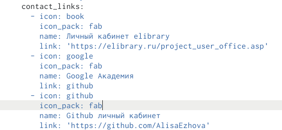
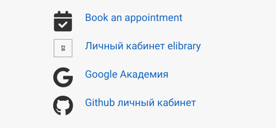
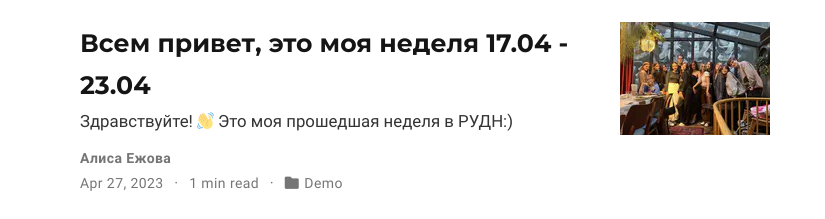
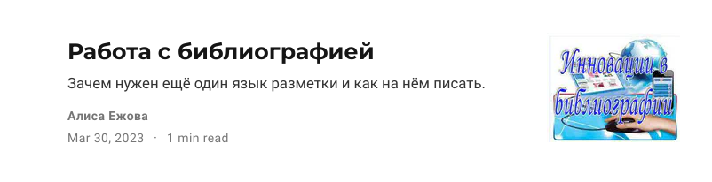

---
## Front matter
lang: ru-RU
title: Индивидуальный порект. Этап 4
subtitle: Ссылки на научные и библиометрические ресурсы
author:
  - Ежова А. М.
institute:
  - Российский университет дружбы народов, Москва, Россия
  - Факультет физико-математических и естесвенных наук
date: 27 апреля 2023

## i18n babel
babel-lang: russian
babel-otherlangs: english

## Formatting pdf
toc: false
toc-title: Содержание
slide_level: 2
aspectratio: 169
section-titles: true
theme: metropolis
header-includes:
 - \metroset{progressbar=frametitle,sectionpage=progressbar,numbering=fraction}
 - '\makeatletter'
 - '\beamer@ignorenonframefalse'
 - '\makeatother'
---

# Информация

## Докладчик

:::::::::::::: {.columns align=center}
::: {.column width="70%"}

  * Ежова Алиса Михайловна
  * студентка НБИбд-01-22
  * Российский университет дружбы народов
  * <https://github.com/AlisaEzhova>

:::
::: {.column width="30%"}


:::
::::::::::::::

# Вводная часть

## Актуальность

- Научиться добавлять к сайту ссылки на научные и библиометрические ресурсы

## Цели и задачи

- Зарегистрироваться на соответствующих ресурсах и разместить на них ссылки на сайте:
   eLibrary : https://elibrary.ru/;
   Google Scholar : https://scholar.google.com/;
   ORCID : https://orcid.org/;
   Mendeley : https://www.mendeley.com/;
   ResearchGate : https://www.researchgate.net/;
   Academia.edu : https://www.academia.edu/;
   arXiv : https://arxiv.org/;
   github : https://github.com/.
- Сделать пост по прошедшей неделе.
- Добавить пост на тему по выбору:
   Оформление отчёта.
   Создание презентаций.
   Работа с библиографией.

## Материалы и методы

- Процессор `pandoc` для входного формата Markdown
- Результирующие форматы
	- `pdf`
	- `html`
- Автоматизация процесса создания: `Makefile`

# Создание презентации

## Процессор `pandoc`

- Pandoc: преобразователь текстовых файлов
- Сайт: <https://pandoc.org/>
- Репозиторий: <https://github.com/jgm/pandoc>

## Формат `pdf`

- Использование LaTeX
- Пакет для презентации: [beamer](https://ctan.org/pkg/beamer)
- Тема оформления: `metropolis`

## Код для формата `pdf`

```yaml
slide_level: 2
aspectratio: 169
section-titles: true
theme: metropolis
```

## Формат `html`

- Используется фреймворк [reveal.js](https://revealjs.com/)
- Используется [тема](https://revealjs.com/themes/) `beige`

## Код для формата `html`

- Тема задаётся в файле `Makefile`

```make
REVEALJS_THEME = beige 
```
# Результаты

## Получающиеся форматы

- Полученный `pdf`-файл можно демонстрировать в любой программе просмотра `pdf`
- Полученный `html`-файл содержит в себе все ресурсы: изображения, css, скрипты

## Содержание исследования

1) Зарегистрировалась на соответсвующих ресурсах разместила на них ссылки на сайте:

{#fig:001 width=90%}

{#fig:002 width=90%}

##

2) Сделала пост по прошедшей неделе:

{#fig:003 width=90%}

##

3) Добавила пост на тему - Работа с библиографией:

{#fig:004 width=90%}

## Итоговый слайд

- В ходе выполнения Индивидуального проекта, этап 4, я научилась добавлять к сайту ссылки на научные и библиометрические ресурсы.
